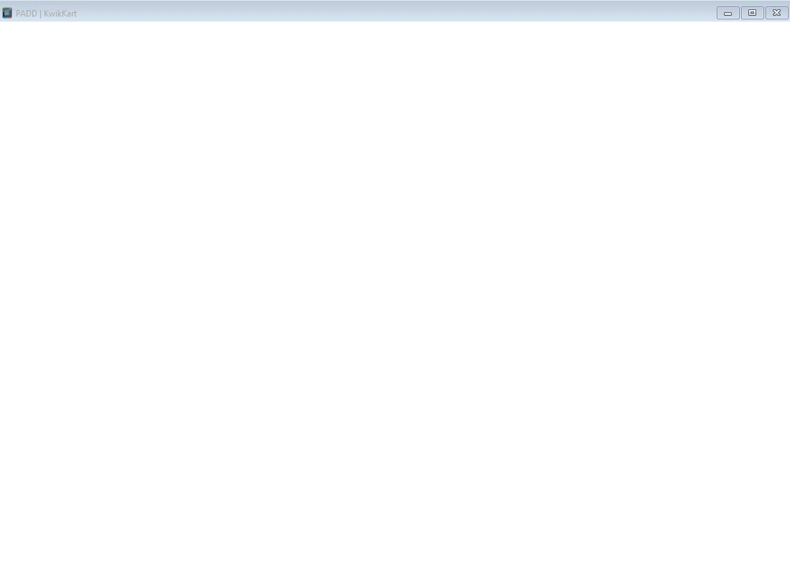

# PADD

**Personal Access Display Device** — a lightweight desktop Markdown viewer and editor built with [Tauri 2](https://v2.tauri.app/).



PADD opens `.md` / `.markdown` files, renders them with GitHub-flavored Markdown, syntax highlighting, and Mermaid diagrams, and lets you edit and save them from a frameless, tabbed window.

## Features

- **View & edit** — toggle between a rendered view and a plain-text editor for the same file.
- **GitHub-flavored Markdown** rendering via [marked](https://marked.js.org/).
- **Syntax highlighting** for fenced code blocks via [highlight.js](https://highlightjs.org/).
- **Mermaid diagrams** rendered inline via [mermaid](https://mermaid.js.org/).
- **Formatting toolbar** in edit mode: bold, italic, strikethrough, H1–H3, bullet / numbered / task lists, blockquote, inline code, code block, link, image, horizontal rule, and Mermaid block. Each action is a single undo step (`Ctrl+Z`).
- **Tabs** — open multiple files at once and cycle them with `Ctrl+Tab`.
- **Light / dark theme** toggle.
- **Zoom** — `Ctrl`+mousewheel (toward the cursor) or the toolbar zoom controls.
- **Multiple ways to open a file** — the Open button / `Ctrl+O` file dialog, drag-and-drop onto the window, a path passed on the command line, or OS file association (`.md` / `.markdown` files open in PADD).
- **Live reload** — PADD watches the open files on disk (polled every ~1.5s) and prompts to reload when they change outside the app.
- **Single instance** — launching PADD again focuses the existing window and opens the new file there instead of starting a second process.
- **Frameless window** with a custom title bar (minimize / maximize / close).

## Quickstart

Requires [Rust](https://www.rust-lang.org/tools/install) (stable) + Cargo, [Node.js](https://nodejs.org/), and your platform's [Tauri 2 system dependencies](https://v2.tauri.app/start/prerequisites/).

```sh
npm install      # install dev deps (Tauri CLI + jsdom), once
npm run dev      # run in development (cargo run inside src-tauri)
npm run build    # release build (cargo build --release)
npm test         # run the jsdom frontend tests
```

Open a file directly by passing its path to the built binary, e.g. `padd path/to/notes.md`.

For platform installers, the full release pipeline, and deeper build docs, see [docs/guides/building-and-releasing.md](docs/guides/building-and-releasing.md).

## Documentation

Full docs live in [`docs/`](docs/README.md):

- **Architecture** — [system overview](docs/architecture/overview.md): repo layout, the single-file frontend, the Rust backend, live reload, OS integration.
- **Guides** — [building and releasing](docs/guides/building-and-releasing.md).
- **Reference** — [Tauri commands](docs/reference/tauri-commands.md) · [keyboard shortcuts](docs/reference/keyboard-shortcuts.md).
